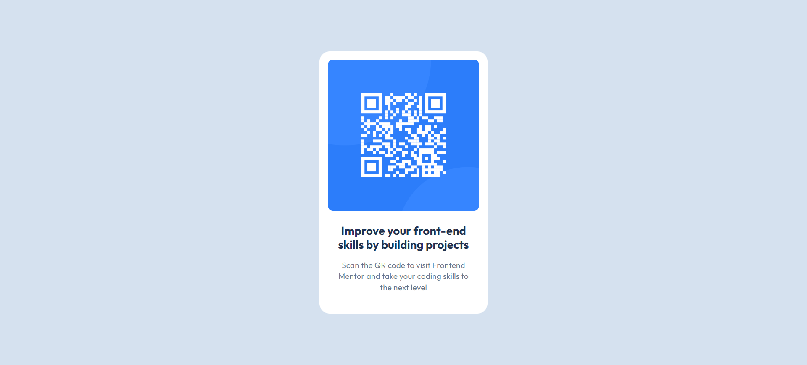

# Frontend Mentor - QR code component

## Overview

This is a solution to the [QR code component challenge on Frontend Mentor](https://www.frontendmentor.io/challenges/qr-code-component-iux_sIO_H). 

[Frontend Mentor](https://www.frontendmentor.io) challenges help you improve your coding skills by building realistic projects.

### The challenge

The challenge I faced is to build out the QR code component and make it as close to the provided design as possible.

### Links

- **Live Site URL**  : [https://qr-code-landing-component.netlify.app/](https://qr-code-landing-component.netlify.app/)
- **Repository URL** : [https://github.com/nithya-aj/frontend_Mentor/tree/main/qr-code-component-main](https://github.com/nithya-aj/frontend_Mentor/tree/main/qr-code-component-main)

## My Process

### Built With

- Semantic HTML5 markup
- CSS custom properties
- Flexbox
- BEM (Block Element Modifier) methodology for CSS class naming

### What I Learned

In this project, I practiced the following:

- Responsive design techniques using CSS Grid and Flexbox.
- Implementing a mobile-first approach to ensure the component is responsive.
- Applying the BEM (Block Element Modifier) methodology to maintain a clear and scalable CSS structure.
  
## Useful Resources

- **MDN** : [https://developer.mozilla.org/en-US/docs/Web/CSS/CSS_flexible_box_layout](https://developer.mozilla.org/en-US/docs/Web/CSS/CSS_flexible_box_layout)
- **BEM Model** : [https://en.bem.info/methodology/css/](https://en.bem.info/methodology/css/)

## Author

- Frontend Mentor - [https://www.frontendmentor.io/profile/nithya-aj](https://www.frontendmentor.io/profile/nithya-aj)
- LinkedIn - [https://www.linkedin.com/in/nithya-aj/](https://www.linkedin.com/in/nithya-aj/)

## Acknowledgments

I would like to thank the Frontend Mentor community for providing such a fantastic platform to improve my front-end skills.
